# Authentication Flow Diagram - QuizStack

## Kompletny diagram przepływu autentykacji

```mermaid
graph TB
    subgraph "User Interface Layer"
        A[User/Browser] --> B{Auth State?}
        B -->|Not Authenticated| C[Login/Register Buttons]
        B -->|Authenticated| D[User Menu Dropdown]

        C --> E[/auth/login]
        C --> F[/auth/register]
        D --> G[/auth/change-password]
        D --> H[/auth/logout]

        E --> I[LoginForm Component]
        F --> J[RegistrationForm Component]
        G --> K[ChangePasswordForm Component]

        L[/auth/forgot-password] --> M[ForgotPasswordForm]
        N[/auth/reset-password] --> O[ResetPasswordForm]
    end

    subgraph "React Components"
        I --> |validate| P[Zod Schema Validation]
        J --> |validate| P
        K --> |validate| P
        M --> |validate| P
        O --> |validate| P

        P --> |valid| Q[API Call]
        P --> |invalid| R[Display Field Errors]
    end

    subgraph "API Endpoints Layer"
        Q --> |POST| S[/api/auth/login]
        Q --> |POST| T[/api/auth/register]
        Q --> |POST| U[/api/auth/logout]
        Q --> |POST| V[/api/auth/change-password]
        Q --> |POST| W[/api/auth/forgot-password]
        Q --> |POST| X[/api/auth/reset-password]
        Q --> |GET| Y[/api/auth/session]
        Q --> |POST| Z[/api/auth/check-username]

        S --> AA[AuthService.login]
        T --> AB[AuthService.register]
        U --> AC[AuthService.logout]
        V --> AD[AuthService.changePassword]
        W --> AE[AuthService.forgotPassword]
        X --> AF[AuthService.resetPassword]
        Y --> AG[AuthService.getCurrentUser]
        Z --> AH[AuthService.checkUsernameAvailability]
    end

    subgraph "Service Layer"
        AA --> AI{Validate Credentials}
        AB --> AJ{Check Username/Email}

        AI --> |valid| AK[Supabase Auth]
        AJ --> |available| AK

        AC --> AK
        AD --> AK
        AE --> AK
        AF --> AK
        AG --> AK
        AH --> AL[Database Query]
    end

    subgraph "Supabase Backend"
        AK --> |signInWithPassword| AM[auth.users]
        AK --> |signUp| AM
        AK --> |signOut| AM
        AK --> |updateUser| AM
        AK --> |resetPasswordForEmail| AM
        AK --> |getSession| AM

        AM --> AN{Auth Success?}

        AN --> |yes - register| AO[Create Profile Record]
        AN --> |yes - login| AP[Set Session Cookie]
        AN --> |yes - logout| AQ[Clear Session]
        AN --> |yes - password reset| AR[Send Email]
        AN --> |no| AS[Return Error]

        AO --> AT[(profiles table)]
        AL --> AT
    end

    subgraph "Middleware Layer"
        AU[Astro Middleware] --> AV{Route Type?}

        AV --> |API Route| AW[Use Service Role Client]
        AV --> |Page Route| AX[Use Regular Client]

        AX --> AY{Check Auth State}

        AY --> |Protected Route + No Session| AZ[Redirect to /auth/login]
        AY --> |Auth Route + Has Session| BA[Redirect to /]
        AY --> |Valid Access| BB[Continue to Page]

        AW --> BB
    end

    subgraph "Page Routing"
        BB --> BC{Page Type}

        BC --> |Public| BD[Layout.astro with AuthButtons]
        BC --> |Protected| BE[ManagementLayout.astro with AuthButtons]

        BD --> BF[Public Quiz Pages]
        BD --> BG[Auth Pages]

        BE --> BH[Dashboard]
        BE --> BI[Quiz Management]
        BE --> BJ[Quiz Creation]
    end

    subgraph "Database Schema"
        AT --> BK[id: UUID - PK]
        AT --> BL[username: TEXT - UNIQUE]
        AT --> BM[created_at: TIMESTAMPTZ]
        AT --> BN[updated_at: TIMESTAMPTZ]

        BK -.->|FK| BO[auth.users.id]
    end

    subgraph "Row Level Security"
        AT --> BP{RLS Policies}

        BP --> BQ[Users can read own profile]
        BP --> BR[Users can update own profile]
        BP --> BS[Service role can insert profiles]
    end

    AP --> |redirect| BD
    AQ --> |redirect| BD
    AZ --> |with ?redirect param| E

    AR --> BT[User Email]
    BT --> |click link| N

    AS --> |401/400/409| BU[Error Response]
    BU --> |display| R

    style A fill:#e1f5ff
    style AK fill:#ffe1e1
    style AT fill:#e1ffe1
    style AU fill:#fff4e1
    style P fill:#f0e1ff

    classDef uiComponent fill:#e3f2fd,stroke:#1976d2,stroke-width:2px
    classDef apiEndpoint fill:#fff3e0,stroke:#f57c00,stroke-width:2px
    classDef service fill:#fce4ec,stroke:#c2185b,stroke-width:2px
    classDef database fill:#e8f5e9,stroke:#388e3c,stroke-width:2px
    classDef middleware fill:#fff9c4,stroke:#f9a825,stroke-width:2px

    class E,F,G,H,I,J,K,M,O uiComponent
    class S,T,U,V,W,X,Y,Z apiEndpoint
    class AA,AB,AC,AD,AE,AF,AG,AH service
    class AT,AM,BO database
    class AU,AV,AW,AX,AY middleware
```

## User Flow Scenarios

### 1. Registration Flow (US-001)

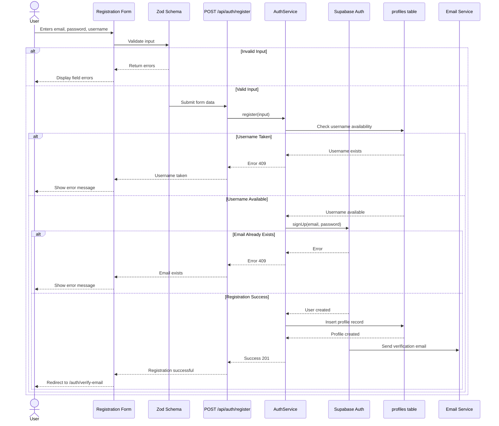

### 2. Login Flow (US-001)

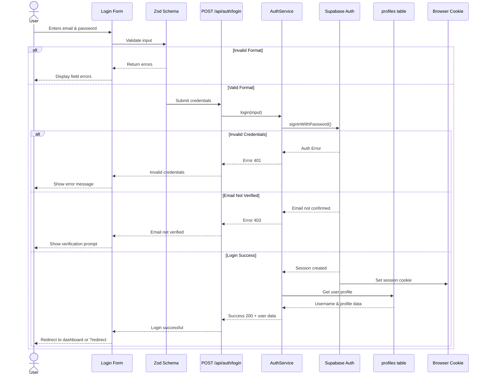

### 3. Password Recovery Flow (US-001)

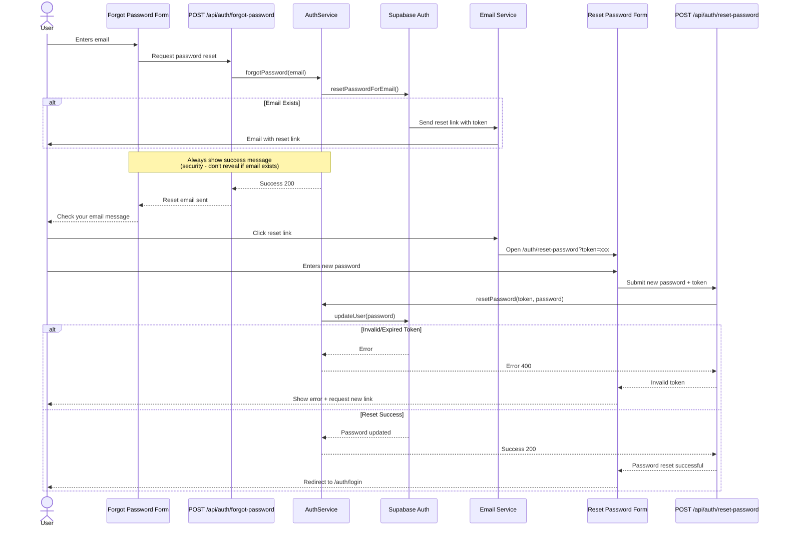

### 4. Protected Route Access (US-002, US-003, US-008)

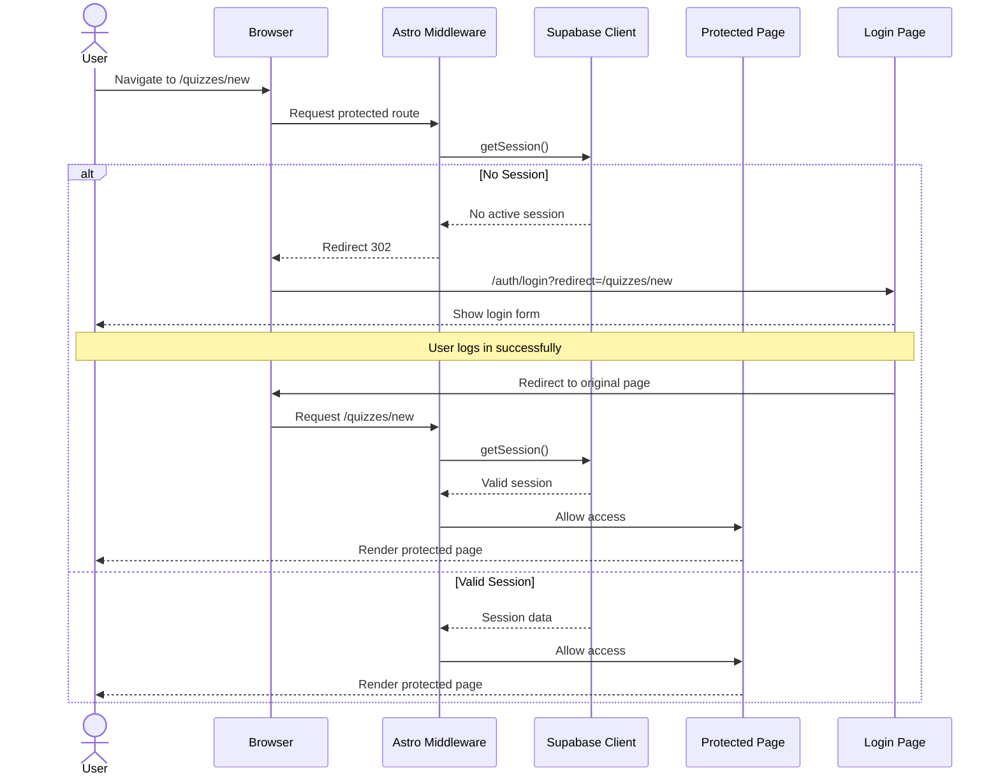

### 5. Logout Flow (US-001)

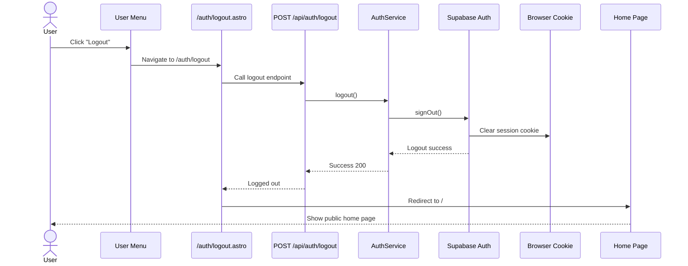

### 6. Change Password Flow (Authenticated User)

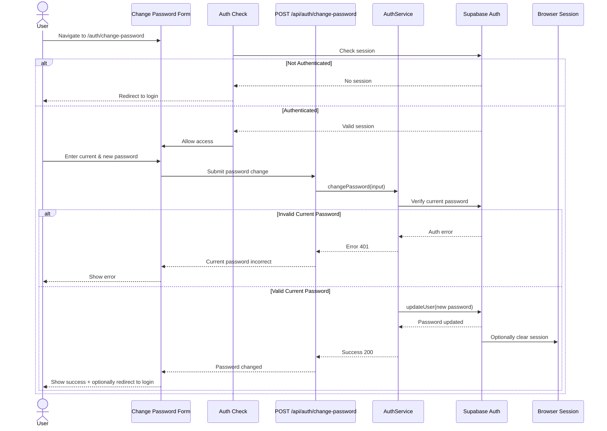

## Component Architecture

### Frontend Components Structure

```mermaid
graph TD
    subgraph "Layouts"
        A[Layout.astro] --> B[AuthButtons]
        C[ManagementLayout.astro] --> B
    end

    subgraph "Auth Pages"
        D[/auth/login.astro] --> E[LoginForm]
        F[/auth/register.astro] --> G[RegistrationForm]
        H[/auth/forgot-password.astro] --> I[ForgotPasswordForm]
        J[/auth/reset-password.astro] --> K[ResetPasswordForm]
        L[/auth/change-password.astro] --> M[ChangePasswordForm]
    end

    subgraph "Shared Components"
        E --> N[AuthContainer]
        G --> N
        I --> N
        K --> N
        M --> N

        N --> O[Shadcn/ui Components]

        G --> P[PasswordStrengthIndicator]
        K --> P
        M --> P

        E --> Q[FormFieldError]
        G --> Q
        I --> Q
        K --> Q
        M --> Q
    end

    subgraph "UI Library"
        O --> R[Form]
        O --> S[Input]
        O --> T[Label]
        O --> U[Alert]
        O --> V[Button]
        O --> W[Dropdown Menu]
        O --> X[Avatar]
    end

    subgraph "Validation"
        E --> Y[Zod Schemas]
        G --> Y
        I --> Y
        K --> Y
        M --> Y

        Y --> Z[auth.schema.ts]
    end

    B --> W
    B --> X

    style A fill:#e3f2fd
    style C fill:#e3f2fd
    style B fill:#fff3e0
    style N fill:#f3e5f5
    style Y fill:#e8f5e9
```

### Backend Architecture

```mermaid
graph TD
    subgraph "API Layer"
        A[/api/auth/login] --> B[AuthService]
        C[/api/auth/register] --> B
        D[/api/auth/logout] --> B
        E[/api/auth/change-password] --> B
        F[/api/auth/forgot-password] --> B
        G[/api/auth/reset-password] --> B
        H[/api/auth/session] --> B
        I[/api/auth/check-username] --> B
    end

    subgraph "Service Layer"
        B --> J[login]
        B --> K[register]
        B --> L[logout]
        B --> M[changePassword]
        B --> N[forgotPassword]
        B --> O[resetPassword]
        B --> P[getCurrentUser]
        B --> Q[checkUsernameAvailability]
    end

    subgraph "Validation Layer"
        A --> R[loginSchema]
        C --> S[registerSchema]
        E --> T[changePasswordSchema]
        F --> U[forgotPasswordSchema]
        G --> V[resetPasswordSchema]

        R --> W[Zod Validation]
        S --> W
        T --> W
        U --> W
        V --> W
    end

    subgraph "Data Access"
        J --> X[Supabase Auth]
        K --> X
        L --> X
        M --> X
        N --> X
        O --> X
        P --> X

        K --> Y[profiles table]
        Q --> Y
        P --> Y

        X --> Z[(auth.users)]
        Y --> AA[(profiles)]

        AA -.->|FK| Z
    end

    subgraph "Middleware"
        AB[Astro Middleware] --> AC{Route Check}
        AC --> AD[Protected Routes]
        AC --> AE[Auth Routes]
        AC --> AF[Public Routes]

        AD --> AG{Session Valid?}
        AE --> AG

        AG -->|No| AH[Redirect to Login]
        AG -->|Yes on Auth Page| AI[Redirect to Home]
        AG -->|Yes on Protected| AJ[Allow Access]

        AF --> AJ
    end

    style B fill:#ffebee
    style W fill:#e8f5e9
    style X fill:#fff3e0
    style AB fill:#e3f2fd
```

## Database Schema with Relationships

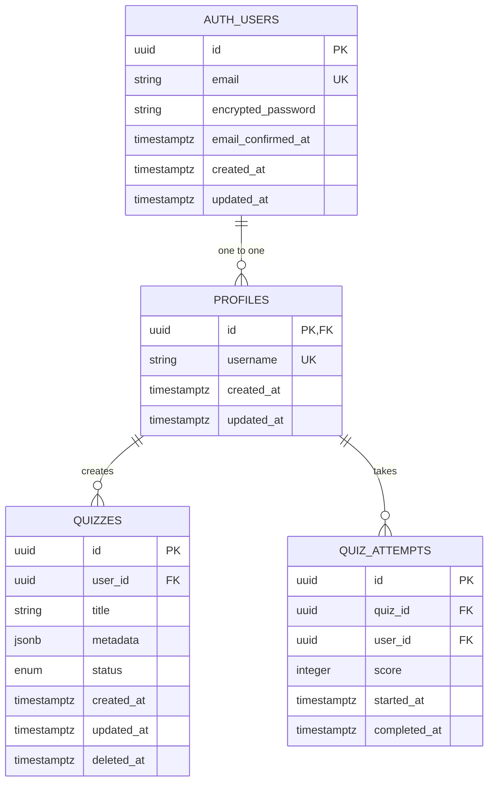

## Row Level Security Policies

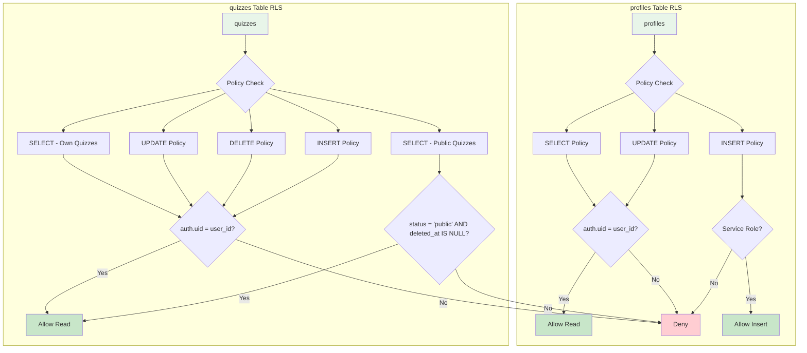

## Security Layers

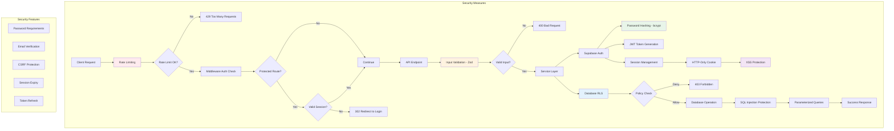

## Error Handling Flow

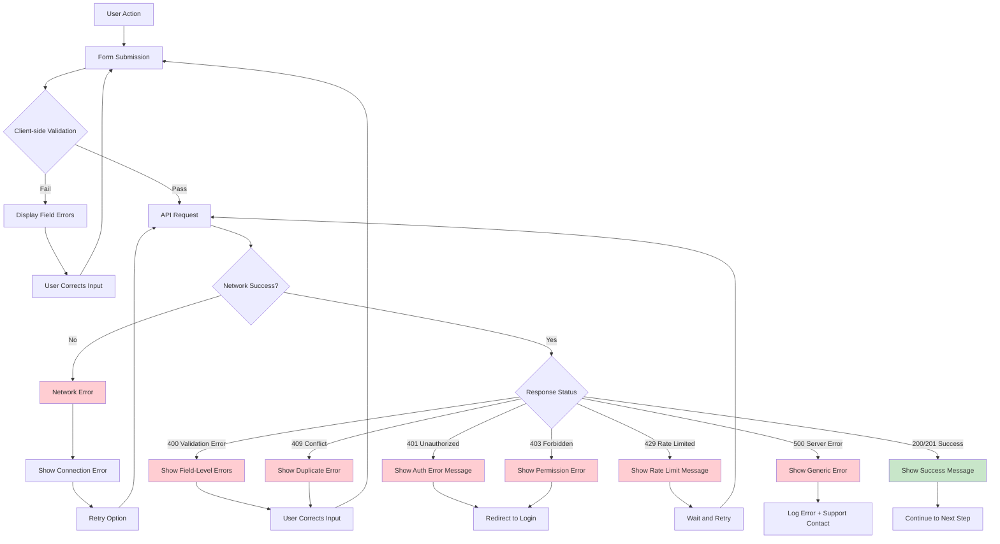

## Implementation Phases

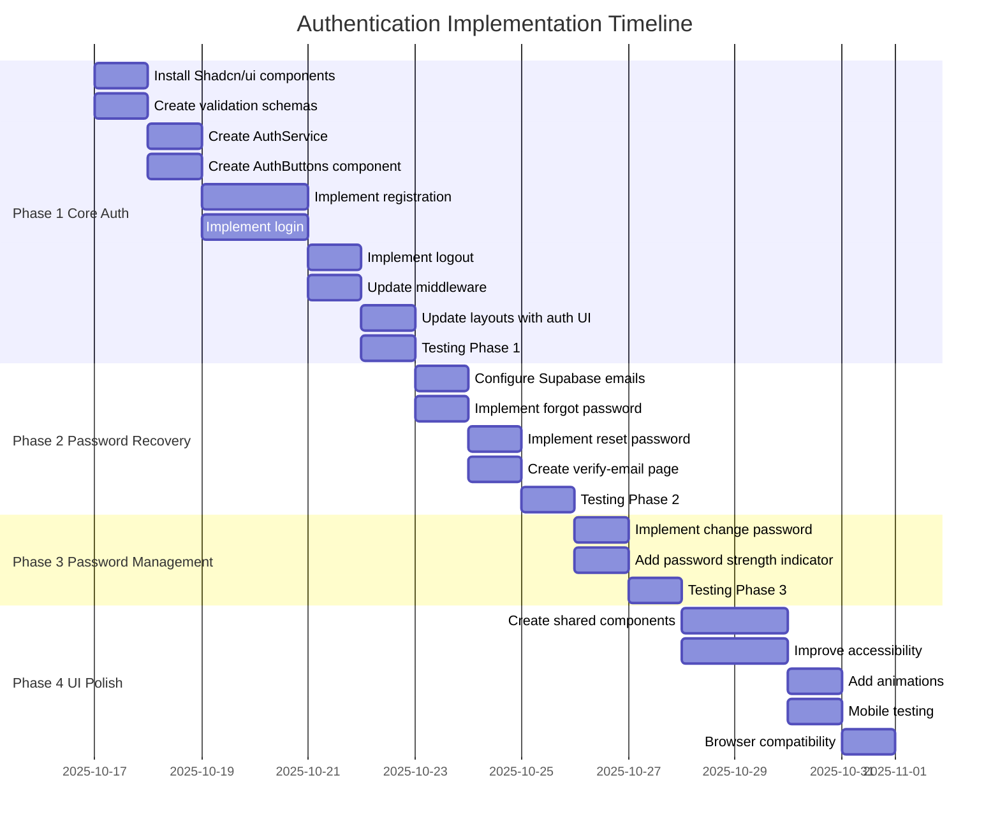

---

## Notatki implementacyjne

### Kluczowe elementy architektury:

1. **Podział odpowiedzialności**:
   - **Astro Pages** (.astro): Server-side rendering, routing, SEO
   - **React Components** (.tsx): Formularze, interaktywność, walidacja klienta
   - **API Routes** (api/auth/\*.ts): Endpointy REST, walidacja serwera
   - **Service Layer**: Logika biznesowa, komunikacja z Supabase
   - **Middleware**: Ochrona tras, zarządzanie sesjami

2. **Bezpieczeństwo**:
   - Hasła haszowane przez Supabase (bcrypt)
   - Sesje zarządzane przez JWT w HTTP-only cookies
   - Row Level Security (RLS) na poziomie bazy danych
   - Rate limiting na krytycznych endpointach
   - Walidacja po stronie klienta i serwera (Zod)

3. **User Experience**:
   - Walidacja w czasie rzeczywistym (on blur)
   - Wyraźne komunikaty błędów
   - Wskaźnik siły hasła
   - Loading states podczas operacji
   - Responsywny design (mobile-first)

4. **Zgodność z PRD**:
   - US-001: ✅ Pełna rejestracja, login, wylogowanie, odzyskiwanie hasła
   - US-002-008: ✅ Ochrona tras wymagających autentykacji
   - Przyciski login/logout w prawym górnym rogu na wszystkich stronach

5. **Supabase Integration**:
   - Automatyczna weryfikacja email
   - Session management z auto-refresh
   - Profile creation linked to auth.users
   - RLS policies dla bezpieczeństwa danych
